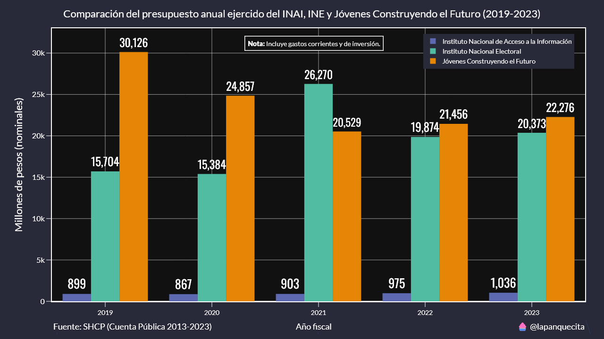
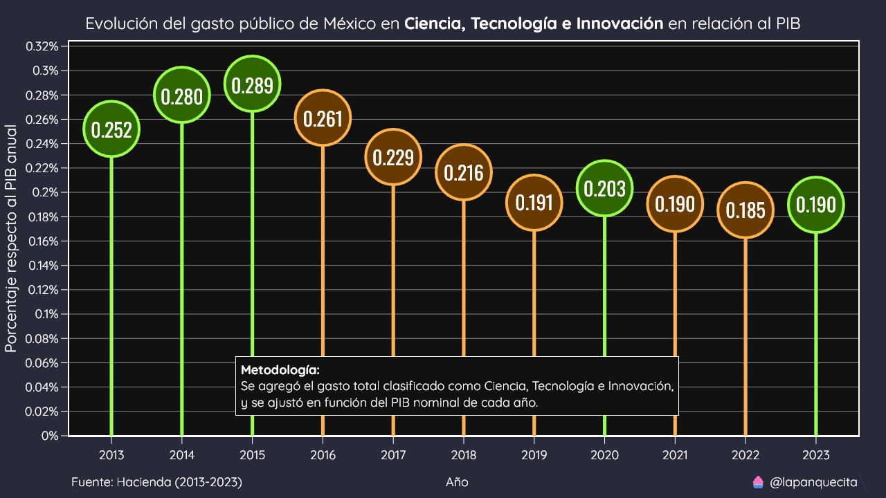

# Cuenta Pública

En este repositorio se encuentran scripts para poder analizar los archivos de la Cuenta Pública de México de los años 2013-2022.

La Cuenta Pública es un documento de contabilidad donde muestra los gastos totales anuales por cada ramo del gobierno.

La Secretaría de Hacienda y Crédito Público (SHCP) tiene a disposición estos documentos en distintos formatos: .pdf, .doc, .xls y .csv, sin embargo no están estructurados de una forma fácil o intuitiva de analizar. El objetivo de este repositorio es proveer esta misma información de una manera eficiente.



Los archivos `.xls` son obtenidos del siguiente sitio web: https://www.cuentapublica.hacienda.gob.mx/

Para extraer la información se sigue un proceso el cual se detalla a continuación.

## Extracción de la infomación

La SHCP, en su portal de Cuenta Pública provee información desde el año 1996, sin embargo solo a partir del año 2013 esta información se encuentra desglosada de manera detallada.

El primer paso es descargar todos los archivos `.xls` y renombrarlos a su ciclo (año) correspondiente. Estos archivos se encuentran en la carpeta `xls`.

El siguiente paso es extraer la información de dichos archivos, el desafío más grande es su estructura jerárquica. El script `converter.py` se encarga de extraer fila por fila y recordar cuales son las categorías padre de cada una.

Una vez que se extrae la información de cada archivo `.xls` se guarda en un nuevo archivo `.csv`. Estos archivos después son unidos en uno solo llamado `data.csv`.

Es importante mencionar que al archivo `data.csv` se le aplican varios filtros para remover datos duplicados e innecesarios que causan inconsistencias al hacer operaciones vectoriales (como sumar totales).

Adicionalmente se genera el archivo `data_total.csv`, el cual solo contiene los totales de cada ramo en cada ciclo. Este archivo es recomendado para análisis más generales que no requieren conocer el desglose por programa.

## Validación de la información

El principal objetivo de este proyecto es poder conocer de manera rápida y sencilla los totales de cada ente, ramo y programa. Para verificar que estos valores sean los correctos se cruzaron con los resultados de los reportes en `.pdf` que se encuentran en el mismo sitio web que los demás archivos.

Los siguientes 4 valores son obtenidos del archivo `.pdf` del año 2022.

* Aprobado 2022 - Poder Legislativo: 15,012.6
* Aprobado 2022 - Poder Judicial: 73,723.0
* Aprobado 2022 - Órganos Autónomos: 56,685.4
* Aprobado 2022 - Ramos Administrativos: 1,514,103.4

Para obtener estas cifras utilizaremos el siguiente código:

```python
df = pd.read_csv("./data.csv")
df = df[df["CICLO"] == 2022]

df = df.pivot_table(index="ENTE", columns="PRESUPUESTO", values="TOTAL", aggfunc="sum")
df = (df / 1000000).round(decimals=1)

print(df)
```

Lo cual nos devolverá la siguiente tabla:

| ENTE                  |        Aprobado |       Devengado |       Ejercicio |      Modificado |
|:----------------------|----------------:|----------------:|----------------:|----------------:|
| Poder Judicial        | 73723           | 74141.7         | 74141.7         | 74181.1         |
| Poder Legislativo     | 15012.6         | 15620.4         | 15620.4         | 15620.4         |
| Ramos Administrativos |     1.5141e+06  |     1.87359e+06 |     1.87359e+06 |     1.87359e+06 |
| Ramos Generales       |     3.70427e+06 |     3.77473e+06 |     3.77473e+06 |     3.77473e+06 |
| Órganos Autónomos     | 56685.4         | 56387.9         | 56387.9         | 56666.4         |

Efectivamente, los 4 valores coinciden sin necesidad de hacer transformaciones adicionales.

El único detalle pendiente es encontrar la combinación de ramos para el total de `Ramos Generales`.

## Notas

En el archivo `data.csv` hay algunas columnas con sufijo, este puede ser `GC` (Gasto Corriente) o `GI` (Gasto de Inversión).

Algunos ramos fueron renombrados a su nombre actual, como es el caso de Desarrollo Social el cual ahora se llama Bienestar.

Las cifras no están ajustadas por la inflación, para realizar esto hay instrucciones en la siguiente sección.

Existe otro conjunto de bases de datos de Cuenta Pública (https://www.transparenciapresupuestaria.gob.mx/Datos-Abiertos), estos archivos cuentan con más detalle, como la entidad federativa y descripciones de las funciones y subfunciones del gasto.

El archivo `data_se.csv` es una versión compacta y limpia de estos archivos generada en el dashboard de la Secretaría de Economía.

https://www.economia.gob.mx/datamexico/es/vizbuilder

Es posible que existan ligeras inconsistencias en los totales debido al redondeo.

## Ajustar las cifras por inflación

Al comparar cifras históricas es importante ajustarlas al mismo poder adquisitivo o inflación, de esta manera la comparación es más justa y se reduce el riesgo de interpretaciones sesgadas.

Para hacer el ajuste se utiliza el `IPC` (Índice de Precios al Consumidor), el cual se obtiene del sitio web de Banxico:

https://www.banxico.org.mx/SieInternet/consultarDirectorioInternetAction.do?accion=consultarCuadro&idCuadro=CP154&locale=es

En este repositorio se encuentra un archivo llamado `IPC.csv`, el cual contiene estos valores ya listos para ser usados.

El siguiente código muestra como ajustar los totales de presupuesto `Aprobado` y `Ejercicio` ajustados por la inflación. Para este ejemplo utilizaremos el total de gastos de la `Secretaría del Bienestar`.

```python
# Cargamos el dataset de IPC.
ipc = pd.read_csv("./IPC.csv", parse_dates=["Fecha"], index_col="Fecha")

# Determinamos el IPC base, el cual sería el más reciente disponible.
ipc_referencia = ipc["IPC"].iloc[-1]

# Vamos a seleccionar el IPC de diciembre de cada año.
ipc = ipc.resample("Y").last()

# Calculamos el factor con una simple división.
ipc["FACTOR"] = ipc_referencia / ipc["IPC"]

# Cambiamos el índice del DataFrame para que sea un integral en lugar de una fecha.
# Esto es para que coincida con el índice del DataFrame de Cuenta Pública.
ipc.index = ipc.index.year

# Cargamos el dataset de Cuenta Pública.
df = pd.read_csv("./data.csv")

# Seleccinamos la Secretaría del Bienestar.
df = df[df["RAMO"] == "Bienestar"]

# Reorganizamos el DataFrame para que el índice sea el año (ciclo) y nuestras
# columnas sean los presupuestos.
df = df.pivot_table(index="CICLO", columns="PRESUPUESTO", values="TOTAL", aggfunc="sum") / 1000000

# Creamos dos nuevas columnas con los valores ajustados.
# Los cuales son el resultado de una simple multiplicación.
# Aprovechamos que Pandas sabe como emparejar los índices.
# De esta forma no tenemos problemas si faltan valores
# en el DataFrame de Cuenta Pública.
df["Aprobado_Ajustado"] = df["Aprobado"] * ipc["FACTOR"]
df["Ejercicio_Ajustado"] = df["Ejercicio"] * ipc["FACTOR"]

print(df)
```

Al ejecutar este código nos devolverá una tabla muy similar a la siguiente:

|   CICLO |   Aprobado |   Ejercicio |   Aprobado_Ajustado |   Ejercicio_Ajustado |
|--------:|-----------:|------------:|--------------------:|---------------------:|
|    2013 |    87897.7 |     85670.9 |              135180 |               131755 |
|    2014 |   111211   |    106135   |              164328 |               156827 |
|    2015 |   114504   |    112440   |              165663 |               162677 |
|    2016 |   109372   |    106212   |              153094 |               148671 |
|    2017 |   105340   |     98804.4 |              138096 |               129529 |
|    2018 |   106646   |    100705   |              133366 |               125936 |
|    2019 |   150606   |    147258   |              183160 |               179088 |
|    2020 |   181457   |    179371   |              213940 |               211481 |
|    2021 |   191725   |    209512   |              210560 |               230094 |
|    2022 |   299316   |    307474   |              304886 |               313197 |

Ya con las cifras ajustadas se puede comparar de mejor manera la evolución del gasto.


## Ajustar las cifras en función del PIB

En ocasiones, las cifras absolutas pueden ser difíciles de entender.

Una técnica común es comparar las cifras respecto al PIB. Cabe recordar que todas las cifras son en valores corrientes, por lo tanto se hará uso del PIB nominal.

Este proceso es bastante sencillo, primero debemos cargar el archivo del PIB.

```python
pib = pd.read_csv("./assets/PIB.csv", index_col=0)
```

Con esto tendremos un `DataFrame` con los años como índice.

Después cargamos el dataset de gast público y lo filtramos por el ramo o función que necesitemos.

```python
# Cargamos el dataset de la Cuenta Pública generado por la Secretaría de Economía.
df = pd.read_csv("./data_se.csv")

# Filtramos por CTI.
df = df[df["Function"] == "Ciencia, Tecnología e Innovación"]

# Agrupamos por la suma anual y seleccionamos la columna de gasto ejercido.
df = df.groupby("Year").sum(numeric_only=True)[["Amount Executed"]]

# Agregamos la columna del PIB nominal.
df["pib"] = pib

# Calculamos el porcentaje respecto al PIB.
df["perc"] = df["Amount Executed"] / df["pib"] * 100
```

Con los valores obtenidos podemos crear una gráfica como la siguiente.

